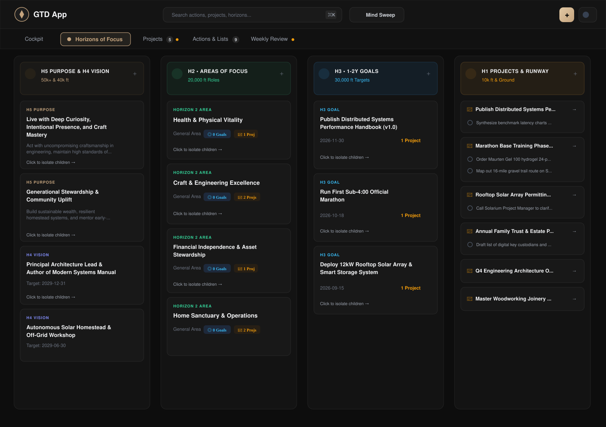
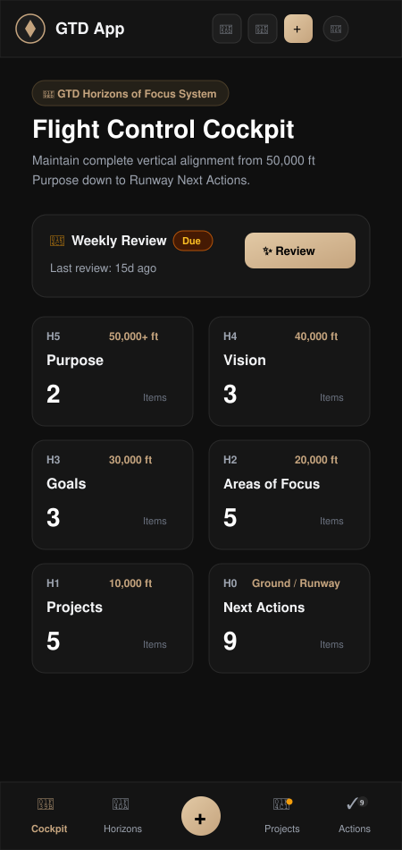

<p align="center">
  
</p>

# 🧭 GTD App — Getting Things Done® Productivity System

> A modern, offline-first GTD productivity web application featuring interactive Horizons of Focus visualization, contextual next action tracking, guided weekly reviews, and granular two-way Google Sheets synchronization.

---

## ✨ Overview

**GTD App** is a faithful, end-to-end digital implementation of David Allen's **Getting Things Done (GTD)** methodology. It bridges high-altitude long-term visions with ground-level runway execution, providing a calm, uncluttered mental workspace to achieve "mind like water."

Designed with an elegant dark luxury theme (warm neutrals, obsidian surfaces, and champagne gold accents), it works seamlessly on desktop and mobile devices as an installable Progressive Web App (PWA).

---

## 📸 App Preview & Screenshots

<p align="center">
  
  <br />
  <em>Desktop View: The 4-Column Horizons of Focus Matrix organizing H5 Purpose &amp; H4 Vision, H2 Areas of Focus, H3 1–2Y Goals, and H1 Projects &amp; Runway actions with active vertical alignment indicators.</em>
</p>

<br />

<p align="center">
  
  <br />
  <em>Mobile View: Responsive Flight Control Cockpit displaying real-time horizon item tallies, weekly review status badges, and one-tap quick capture dock.</em>
</p>

---

## 🚀 Key Features

### 1. 🏔️ Horizons of Focus (All 6 Altitudes)
Visualize and connect every single task to your overarching life purpose:
- **Horizon 5 (50,000+ ft) — Purpose & Principles**: Define your core mission, non-negotiable personal values, and guiding operating principles.
- **Horizon 4 (40,000 ft) — Vision**: Long-term directional goals (3–5+ years) across career, personal growth, health, and finances.
- **Horizon 3 (30,000 ft) — Goals & Objectives**: Tangible 1–2 year milestones that materialize your visions.
- **Horizon 2 (20,000 ft) — Areas of Focus & Responsibility**: Core life domains and maintenance standards (e.g., Health, Career, Family, Wealth).
- **Horizon 1 (10,000 ft) — Current Projects**: Multi-step outcomes achievable within a year that require more than one action step.
- **Runway (Ground) — Next Actions**: Discrete, physical, actionable next physical steps executed in specific contexts.

### 2. 🗺️ Interactive Horizon Graph & Tree View
- **Dual Visual Modes**:
  - **Graph Tree View**: Interactive hierarchical map illustrating vertical alignment from H5 Purpose down through Visions, Areas, Goals, Projects, and leaf Actions.
  - **Altitude Matrix**: Structured column-based view with quick drill-downs and parent-child navigation.
- **Mobile-Optimized Layout**: Compact badges, concise action controls, dynamic collapse/expand branches, and fluid pan/zoom controls.

### 3. ⚡ Runway & Contextual Next Actions
- **Context Filtering**: Organize actions by `@computer`, `@phone`, `@errands`, `@office`, `@home`, `@agenda`, `@anywhere`, and `@read/review`.
- **Multi-Dimensional Triage**: Filter by **Energy Level** (*High*, *Medium*, *Low*) and **Time Required** (*5m*, *15m*, *30m*, *1h*, *2h+*).
- **Waiting For List**: Track delegated items, responsible individuals, and follow-up deadlines.
- **Someday / Maybe Incubator**: Keep parked ideas out of your daily view until ready for review.
- **Recurring Habits & Routines**: Build consistency with recurring action streaks, daily logs, and history tracking.

### 4. 🧹 Mind Sweep & Clarify Engine
- **Mind Sweep Modal**: Clear open loops with curated trigger lists across professional obligations, personal projects, finances, and maintenance tasks.
- **Clarify Flow**: Step-by-step GTD decision tree for captured inbox items:
  - *Is it actionable?* → If no: Trash, Incubate (Someday/Maybe), or File (Reference).
  - *Under 2 minutes?* → Do it now!
  - *Multi-step?* → Create a dedicated Project.
  - *Delegate or Defer?* → Assign to Waiting For or schedule in Next Actions.

### 5. 📅 Guided Weekly Review Wizard
Step-by-step interactive workflow to maintain trusted system integrity:
1. **Get Clear**: Empty your head (Mind Sweep) and process physical/digital loose papers.
2. **Get Current**: Zero inboxes, review past calendar logs, and preview upcoming obligations.
3. **Review Waiting For & Projects**: Verify active drivers, update statuses, and ensure every active project has at least one concrete Next Action.
4. **Review Someday / Maybe & Horizons**: Align weekly priorities with higher horizons.
5. **Review History & Streaks**: Celebrate completed reviews with confetti and persist review history.

### 6. 📊 Granular Two-Way Google Sheets Sync
- **Non-Destructive Row Updates**: Synchronizes data item-wise instead of wiping sheets, preserving custom formulas, cell formatting, and adjacent notes.
- **Auto & Manual Sync**: Seamless background synchronization via Google Identity Services (OAuth 2.0).
- **Cloud Backup**: Export and restore complete workspace state via clean JSON backups anytime.

### 7. 📱 PWA & Offline-First Architecture
- Installable on iOS, Android, macOS, and Windows.
- Full offline capability using `localStorage` caching with automatic reconnection sync.

---

## 🛠️ Tech Stack

- **Framework**: [React 19](https://react.dev/) + [TypeScript](https://www.typescriptlang.org/)
- **Build Tool**: [Vite 6](https://vite.dev/)
- **Styling**: [Tailwind CSS v4](https://tailwindcss.com/)
- **Animations**: [Motion](https://motion.dev/) (Framer Motion)
- **Icons**: [Lucide React](https://lucide.dev/)
- **Effects**: [canvas-confetti](https://www.npmjs.com/package/canvas-confetti)
- **Cloud Integrations**: Google Identity Services (OAuth 2.0) & Google Sheets API v4

---

## 📂 Project Structure

```text
├── public/                     # Static assets, PWA icons, manifest.json
├── src/
│   ├── components/             # UI Components & Feature Views
│   │   ├── DashboardView.tsx   # Runway summary, high-priority actions & stats
│   │   ├── NextActionsView.tsx # Contextual task lists, contexts & filters
│   │   ├── ProjectsView.tsx    # Active/someday projects, outcomes & drivers
│   │   ├── HorizonsView.tsx    # Horizons of Focus matrix & management
│   │   ├── HorizonsMap.tsx     # Visual interactive tree graph of all horizons
│   │   ├── ReviewsView.tsx     # Review history, cadence stats & trends
│   │   ├── WeeklyReviewModal.tsx# Multi-step guided GTD review wizard
│   │   ├── MindSweepModal.tsx  # Trigger list-driven brain dump utility
│   │   ├── ClarifyModal.tsx    # GTD decision tree for inbox processing
│   │   ├── QuickCaptureModal.tsx# Fast keyboard-driven inbox capture
│   │   ├── GoogleAuthModal.tsx # Google Sheets connection & sync settings
│   │   └── Navbar.tsx          # Navigation, search, sync indicator & quick capture
│   ├── context/
│   │   └── GTDContext.tsx      # Central state management & persistence
│   ├── data/
│   │   └── gtdData.ts          # Default GTD horizons structure & sample items
│   ├── services/
│   │   ├── googleAuth.ts       # Google Identity Services (GSI) OAuth client
│   │   └── googleSheets.ts     # Item-wise Google Sheets API sync engine
│   ├── types/
│   │   └── gtd.ts              # TypeScript domain types & interfaces
│   ├── utils/                  # Date helpers, streak math & backup utilities
│   ├── App.tsx                 # Root layout & view router
│   ├── main.tsx                # Application bootstrap
│   └── index.css               # Global typography & Tailwind CSS styles
├── metadata.json               # Application metadata
├── package.json                # Project dependencies & scripts
├── tsconfig.json               # TypeScript configuration
└── vite.config.ts              # Vite bundler configuration
```

---

## ⌨️ Keyboard Shortcuts

| Shortcut | Action |
| :--- | :--- |
| `Q` | Open Quick Capture modal |
| `Ctrl + K` / `Cmd + K` | Global Search across actions, projects & horizons |
| `Esc` | Close any open modal or drawer |

---

## 🏁 Getting Started

### Prerequisites
- **Node.js**: v18.0.0 or higher
- **npm** or **bun** / **yarn** / **pnpm**

### Installation

1. **Clone the repository:**
   ```bash
   git clone https://github.com/your-username/gtd-app.git
   cd gtd-app
   ```

2. **Install dependencies:**
   ```bash
   npm install
   ```

3. **Start the development server:**
   ```bash
   npm run dev
   ```
   The application will be accessible at `http://localhost:3000`.

4. **Build for production:**
   ```bash
   npm run build
   ```

5. **Type check & lint:**
   ```bash
   npm run lint
   ```

---

## 📑 Google Sheets Sync Configuration (Optional)

To enable two-way synchronization with your personal Google Drive:
1. Open the app and click the **Google Sheets Sync** icon in the top navigation bar.
2. Sign in with your Google account using Google Identity Services.
3. Choose to either **create a new GTD spreadsheet** or link an **existing spreadsheet ID**.
4. The app creates dedicated sheets:
   - `Actions`: Contextual next actions, waiting for, someday, and routines.
   - `Projects`: Active outcomes, status, priority, and progress.
   - `Horizons`: H5 Purpose, H4 Visions, H3 Goals, and H2 Areas of Focus.
   - `Reviews`: Weekly review log and timestamps.

---

## 📜 License

This project is licensed under the [MIT License](LICENSE).

---

*Getting Things Done® and GTD® are registered trademarks of the David Allen Company. This application is an independent productivity tool designed to support the methodology.*
